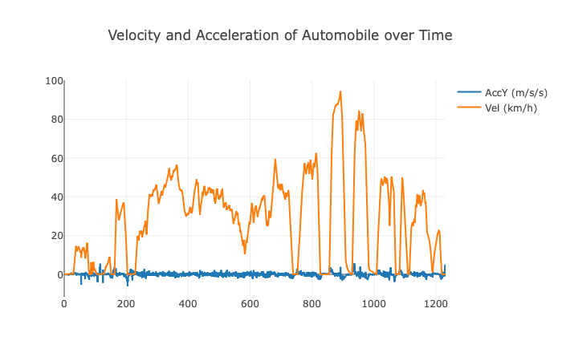

# Project Title

Google Science Journal Recording plotter

## Description

Analyzes and plots accelerometer data from science journal recording



## Getting Started

### Dependencies

* Click==7.0
* dash==1.6.0
* dash-core-components==1.5.0
* dash-html-components==1.0.1
* dash-renderer==1.2.0
* dash-table==4.5.0
* Flask==1.1.1
* Flask-Compress==1.4.0
* future==0.18.2
* itsdangerous==1.1.0
* Jinja2==2.10.3
* MarkupSafe==1.1.1
* numpy==1.17.3
* pandas==0.25.3
* plotly==4.2.1
* python-dateutil==2.8.1
* pytz==2019.3
* retrying==1.3.3
* scipy==1.3.1
* six==1.13.0
* Werkzeug==0.16.0


### Installing

* Change to the project directory, the one you cloned. For example, `cd analyze`. 
* Enter the following commands after the `$` prompts :
```
Cyndis-MacBook-Pro:analyze cyndi$ python3 -m venv env
Cyndis-MacBook-Pro:analyze cyndi$ source env/bin/activate
(env) Cyndis-MacBook-Pro:analyze cyndi$ pip install -r requirements.txt 
```
### Executing program

* Enter the following command in the project directory:
```
(env) Cyndis-MacBook-Pro:analyze cyndi$ python analyze.py --file data/Driving\ -\ Recording\ 1.csv
```
Note: any CSV file produced by Google Science Journal when exporting Three-Axis Accelerometer data may be used. The device's
 Y-axis is assumed to be aligned with the vehicle longitudinally. Of course, a little math or using the linear 
 accelerometer instead, would obviate the need for such alignment of the device. 

## Help

Here are the header line and the first few data points of the provided real-life sample file that I recorded while
driving, with the phone resting in the center console pointing with the top towards the front of the vehicle.
You can see that the timestamp, here I used absolute time in Google Science Journal, is absolute time in ms since the 
UNIX epoch. The other values are m/s^2, with the 9.xxx AccZ values indicating Earth's gravity, that being the side placed
down. It varies because the positioning of the phone was imperfect, and there were speed bumps and some grades, creating
vertical acceleration as well. Actually this data could be analyzed on each axis to get a more complete picture of my ride.

```
timestamp,AccX,AccY,AccZ
1567560367986,-0.07379653930664062,0.5849835205078125,9.625433807373048
1567560368016,-0.10627899169921876,0.6074368286132813,9.758058013916017
1567560368083,-0.10747650146484375,0.6120771789550782,9.614955596923828
```

## Authors

Charles Cavanaugh Ph.D. (Cynthia)

## Version History

* 0.1
    * Initial Release

## License

MIT License

## Acknowledgments

* Inspired by Plotly dash core sample code. 
* Added own data source and math to integrate to obtain velocity from raw
acceleration and to account for time passage in everyday units.
